# HappenHere

Image from: [Am I Resoponsive](https://ui.dev/amiresponsive)

## Contents:
- [Description](#description)
- [Design and Planning](#design-and-planning)
    - [Design & Ideation](#design-and-ideation)
        - [Typography](#typography)
        - [Colour Scheme](#colour-scheme)
        - [Images](#images)
    - [Wireframes](#wireframes)
    - [Database ERD](#database-erd)
    - [Agile Methodology](#agile-methodology)
- [Features](#features)
    - [User Authentication](#user-authentication)
    - [Custom Model](#custom-model)
    - [CRUD Functionality](#crud-functionality)
    - [Notifications](#notifications)
- [Testing and Validation](#testing-and-validation)
    - [HTML](#html)
    - [CSS](#testing-and-validation)
    - [JavaScript](#javascript)
    - [Python](#python)
    - [Googles Lighthouse Performance](#google-lighthouse-performance)
    - [WAVE Accessibility](#wave-accessibility)
    - [Browser Compatability](#browser-compatability)
- [Bugs](#bugs)
- [Future features and Development](#future-features-and-development)
- [AI](#ai)
    - [Code Creation](#code-creation)
    - [Debugging](#debugging)
    - [Optimisation and User Experience](#optimisation-and-user-experience)
    - [Unit Tests](#unit-tests)
    - [Process and Workflow](#process-and-workflow)
- [Deployment](#deployment)
- [Technologies Used](#technologies-used)
- [Credits](#credits)

## Description
HappenHere is a community event booking platform, where users can host, browse and join local happenings.

It is a full-stack web application designed to bring communities together through local events, fundraisers and social gatherings.

Users are able to:
- Browse through events
- Check out the information about the event
- Book a space for the event / Cancel their booking
- Host their own events / Edit & Delete

## Design and Planning
### Design and Ideation
The idea for HappenHere stemmed from the neighbourhood social networking app "Nextdoor". It is a platform used to join your local neigbourhood where you are able to get local tips, buy and sell items, and more. It includes a section about local events in the area that users are able to browse through and are also able to host their own events and put that they are interested in going.
#### Typography
[fontpair](https://www.fontpair.co/) was used to find different pairings of font to see what would look good together. I found that the combination of Raleway and Roboto was nice and friendly, giving good readability to the user.

[Google fonts](https://fonts.google.com/) was then used to import the fonts.


#### Colour Scheme
Based of the type of project I was making, I asked chatgpt to give me some sample colour schemes I could use for the project. Upon check them out on [coolers](https://coolors.co/) I went with the following colour scheme for the light community feel it gave:


#### Images
Default images, Icons and Logos used in the website were either generated using ChatGPT or taken from existing images on [Freepik](https://www.freepik.com/).

### Wireframes
| Page | Wireframe |
| --- | ----------- |
| Home |  |
| All Events |  |
| Event Detail |  |
| Event Detail - Edit |  |
| Event Detail - Cancel booking / Delete event |  |
| My Events - Host |  |
| My Events - Host Form |  |
| My Events - Booked / Published |  |

### Database ERD


### Agile Methodology
User stories were tagged using MoSCoW prioritisation:
- must-have - Mandatory for MVP
- should-have - Important but not vital
- could-have - Nice to have but till not

#### Project Board & User Stories
| Detail | Image |
| :---: | :-----------: |
| Issues in repo (leftover) |  |
| Github Project Board & User Stories |  |

The project board for this project can be seen here:
<a href="https://github.com/users/KoroYsabela/projects/8" target="_blank">HappenHere - Project Board</a>

## Features
| Feature | Image |
| :---: | :-----------: |
| Homepage  | 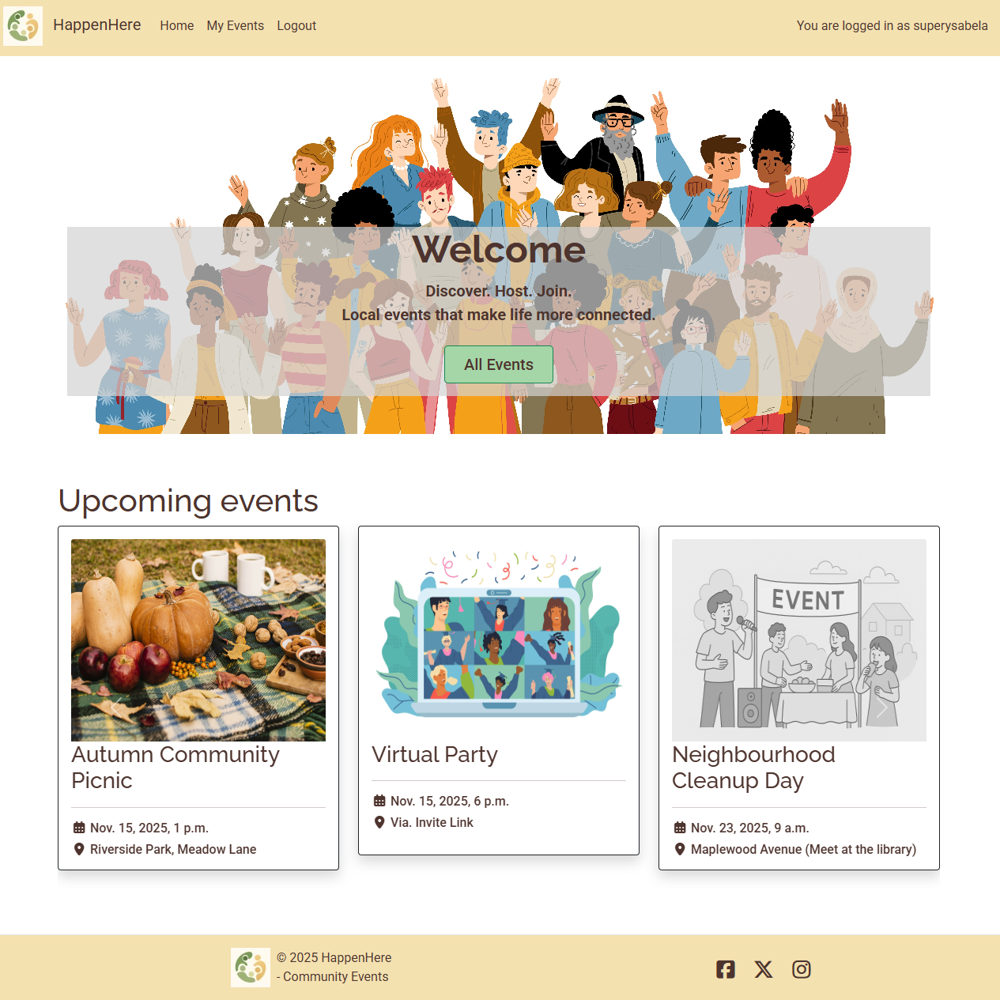 |
| All Events | 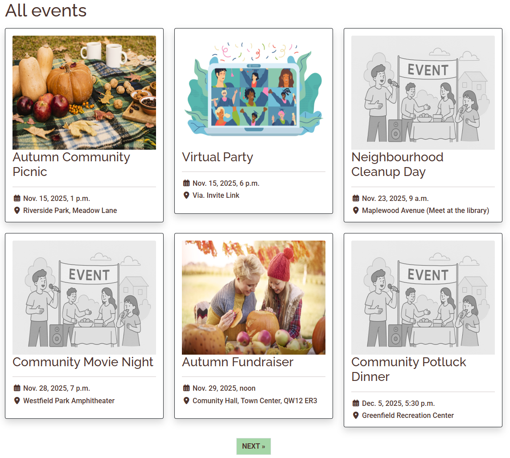 |
| Event Detail | As shown in [CRUD Functionality](#crud-functionality) |
| Event Detail - Book | 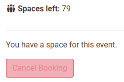 |
| Event Detail - Cancel Booking | 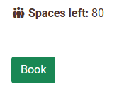 |
| Event Detail - Edit Event | As shown in [CRUD Functionality](#crud-functionality) |
| Event Detail - Delete Event | As shown in [CRUD Functionality](#crud-functionality) |
| My Events - Host Tab | 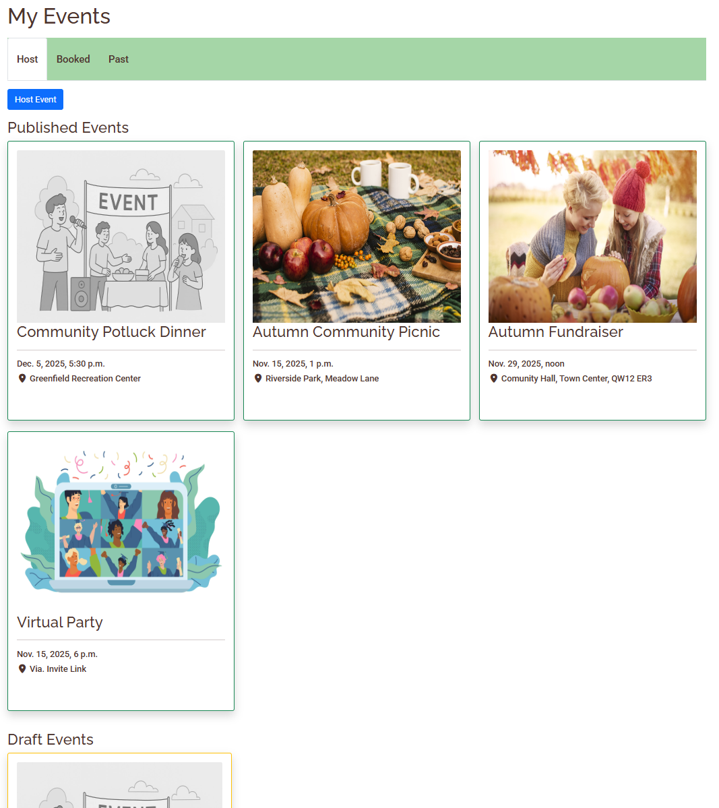 |
| My Events - Host Event Form | As shown in [CRUD Functionality](#crud-functionality) |
| My Events - Booked Tab | 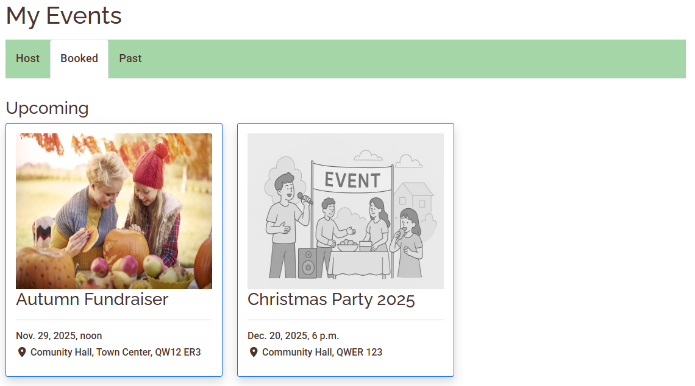 |
| My Events - Past Tab | 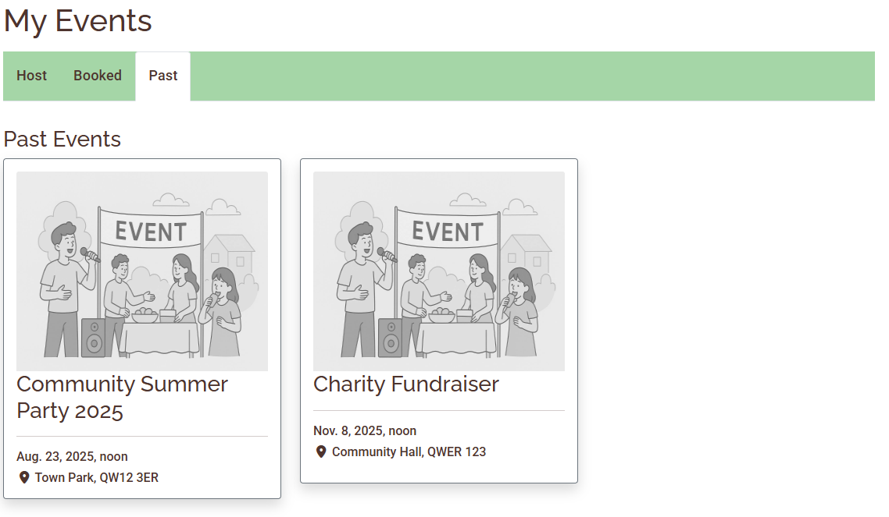 |

### User Authentication
`django-allauth` was used to allow the user to create an account so they can host and book events. Without an account they will only be able to browse and look at event information.
|  | Image |
| :---: | :-----------: |
| Register  | 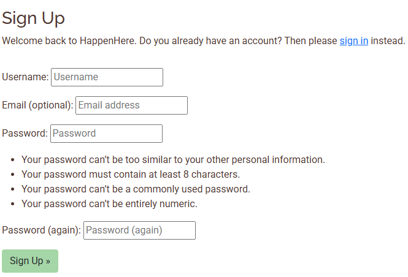 |
| Sign In | 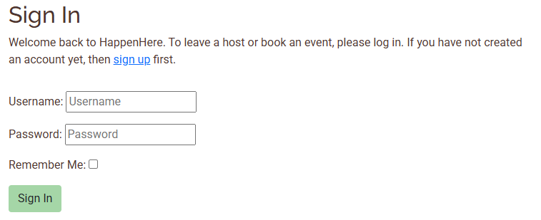 |
| Sign In - Message | 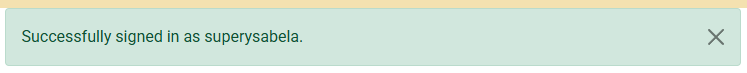 |
| Signout | 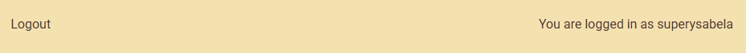 |
| Signout - Confirmation | 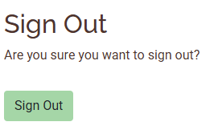 |

### Custom Model
The main custom model in the project is the `event` modal: 
```py
  class Event(models.Model):
    """
    Store a single event created by host (user)
    """
    title = models.CharField(max_length=100, unique=True)
    slug = models.CharField(unique=True, blank=True)
    date = models.DateTimeField()
    location = models.CharField(max_length=150)
    host = models.ForeignKey(
                    User,
                    on_delete=models.CASCADE,
                    related_name="hosted_events")
    description = models.TextField(blank=True)
    capacity = models.PositiveIntegerField()
    featured_image = CloudinaryField('image', default='placeholder')
    created_on = models.DateTimeField(auto_now_add=True)
    status = models.IntegerField(choices=STATUS, default=0)
    updated_on = models.DateTimeField(auto_now=True)

    def save(self, *args, **kwargs):
        # Create slug from title if not already set (from admin)
        # as slug creation is not in host event form
        if not self.slug:
            base_slug = slugify(self.title)
            slug = base_slug
            # Handle any duplicate titles by using counter
            counter = 1
            while Event.objects.filter(slug=slug).exists():
                slug = f"{base_slug}-{counter}"
                counter += 1
            self.slug = slug
        super().save(*args, **kwargs)

    class Meta:
        ordering = ["-date"]

    def __str__(self):
        return f"{self.title} | hosted by {self.host}"
```

### CRUD Functionality
| CRUD Functionality | Image |
| :---: | :-----------: |
| Create  | 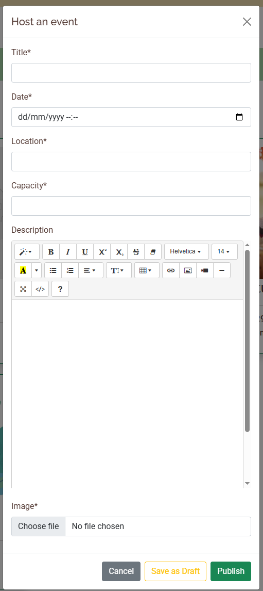 |
| Read | 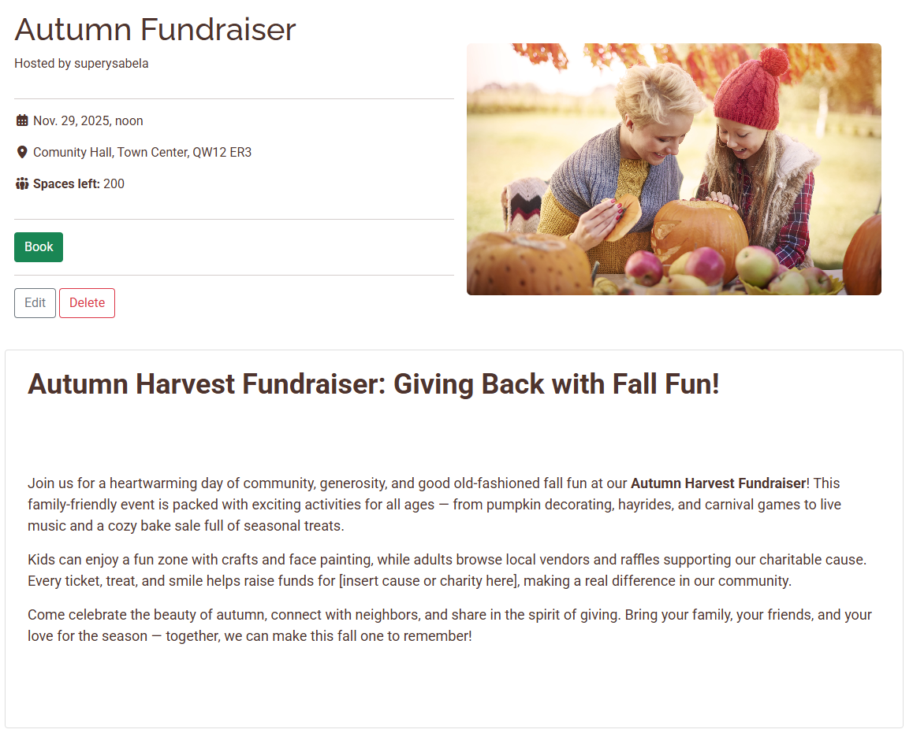 |
| Update | 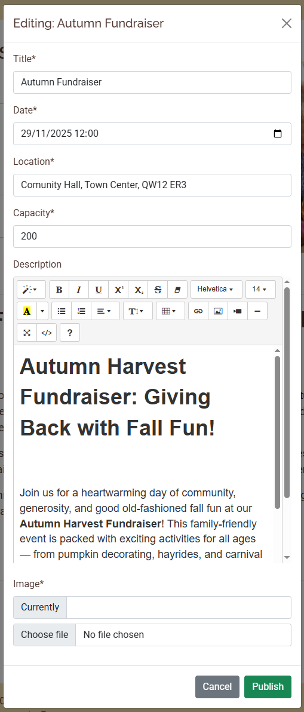 |
| Delete | 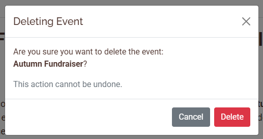 |

### Notifications
Upon doing any of the CRUD funcionality, a message is displayed at the top of the page to notfiy the user of the action they have just completed. This includes the same with booking and cancelling a space for an event, as shown in this sample image:

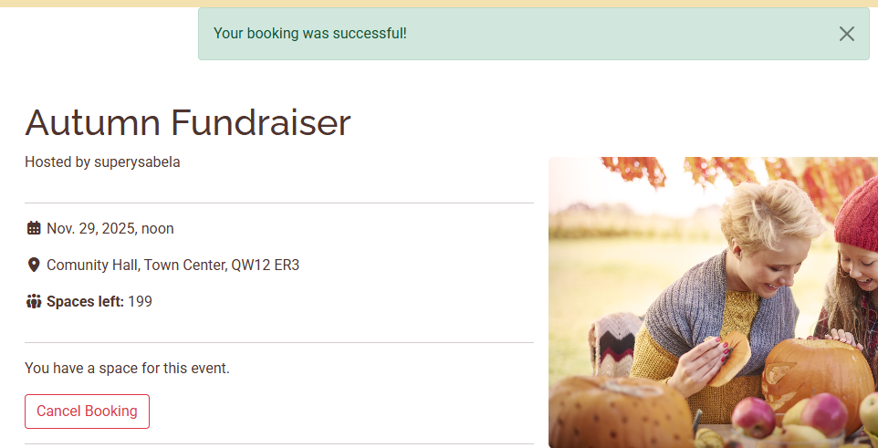

## Testing and Validation
Everything in the tables were tested and validated, but due to high number of files only a few images were taken and included.
### HTML
| HTML | Pass/Fail |
| :---: | :-----------: |
| `events/templates/events/index.html`  |  |
| `events/templates/events/all_events.html` | PASS |
| `events/templates/events/event_detail.html` | WARNING & ERRORS (if using link to an event) - due to the use of django summernote widgets / PASS (when using `.html` file with warnings from the use of django code) |
| `myevents/templates/myevents/my_events.html` | PASS |
| `myevents/templates/myevents/login.html` | PASS |
| `myevents/templates/myevents/logout.html` | PASS |
| `myevents/templates/myevents/signup.html` | PASS |

### CSS
| CSS | Pass/Fail |
| :---: | :-----------: |
| `static/css/style.css` |  |

### JavaScript
| Script | Pass/Fail |
| :---: | :-----------: |
| `static/js/evensHome.js` |  |

### Python
| HTML | Pass/Fail |
| :---: | :-----------: |
| `config/settings.py`  |  |
| `config/urls.py` | PASS |
| `events/admin.py` | PASS |
| `events/forms.py` | PASS |
| `events/models.py` | PASS |
| `events/urls.py` | PASS |
| `events/views.py` | PASS |
| `myevents/forms.py` | PASS |
| `myevents/models.py` | PASS |
| `myevents/urls.py` | PASS |
| `myevents/views.py` | PASS |

### Googles Lighthouse Performance
| Device | Performance | Accessibility | Best Practices | SEO |
| :---: | :-----------: | :-----------: | :-----------: | :-----------: |
| Mobile | ... | ... | ... | ... |
| Desktop | ... | ... | ... | ... |

Performance is slightly lower due to having images for the event cards. Although a max size limit was added to do how much clouadinary could handle, in addition to the compressed default image, a lot of images on a page will naturally cause performance issues.

Best Practices were also lower due HTTPS from allowing the user to upload their own image.

### WAVE Accessibility
General testing on different pages using this tool showed no errors:


### Browser Compatability
This has been run on Google Chrome, Microsoft Edge and Mozilla Firefox. All which seem to run well.

## Bugs
Currently known: 
- non-breaking bugs:
    - If a user gets a hold of the slug of a draft event, they are able to interact with the event - such as, make a booking. This couldn't be fixed due to time constraints, however, a user shouldn't be able to see any other users draft events as only published events are displayed through the sure.    

Throughout development:
- Fixed:
    - Edit form - Using django `SummernoteWidget()`
        - This was a main issue I had in my development process due to wanting to integrate the django-summernote with my forms to edit my events, as the editor would allow the user to have full control of how they wanted to show off the event description.
        - I originally wanted to use the edit feature in the my events - host - published tab, but as it turns out, due to the amount of events on 1 page and using 1 modal to get the information, the widget seemed to get confused on how to prepopulate the description field and would only return that as empty. As a result I moved the edit feature to the events detail page, which could only be seen if the user was the host.

## Future features and Development
As seen in the [Agile Methodology](#agile-methodology) section, there were still some left over user stories that were not completed. If there was a chance for more time  or continous work on this project, they would all me implememted

## AI
### Code Creation
My whole `eventsHome.js` file was created using github copilot. In the home page I wanted the carousel of events to display a specific number based on screen size, but no matter how much I tried to create it myself, the carousel items would stay stacked ontop of each other on smaller screens.

Additionally, a problem I realised too late was that when adding an image to the event form / editing it, the file size would be too large for cloudinary to handle so I asked copilot for help fixing this and it created the function: 

```def clean_featured_image(self)``` in ```myevents/forms.py```, which shows an error if the filesize of the image the user is trying to upload is too high.

### Debugging
I consistently used chatgpt and github copilot to help my figure out why a specific part of the project was not working and it would give me reasons as to why they could be happening alongside possible fixes, which I used to help solve the problem.

### Optimisation and User Experience
AI was used to help quickly create ideas, user stories, default images, logo and colour themes for the project. This helped provide 

### Unit Tests
AI was not used to create unit tests as all the features of the site were manually tested.

### Process and Workflow
Overall, due to other priorities at the time of the project and time constraints, AI was used heavily to help speed up completion of the project; mainly in javascript files and understanding how to add to the views.py files.

Additionally, the high usage of AI to help me with this project helped me realise it is better to use it to help understand problems and give examples/options of how to go about fixing the problem. This was because some code it would provide would cause more problems/errors which in turn wasted a lot of time also trying to fix. 

## Deployment
Procedure to 


View the deployed project on heroku: <a href="https://happenhere-ea5273c6b3f0.herokuapp.com/" target="_blank">HappenHere</a>

## Technologies Used
| Project Section | Tool |
| :---: | :-----------: |
| Front-End | HTML<br/>CSS<br/>Bootstrap 5<br/>Django Template |
| Back-End | Django Framework<br/>PostgreSQL Database |
| Languages | Python<br/>Javascript |
| Cloud & Deployment | Heroku<br/>Cloudinary |
| Other | Git<br/>Github<br/>ChatGTP<br/>Github Copilot |

## Credits
