# HappenHere
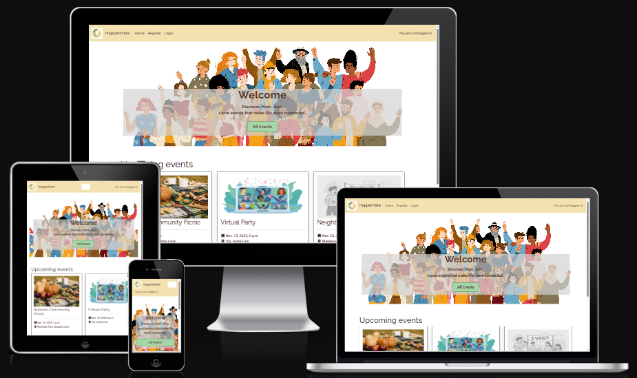
Image from: [Am I Resoponsive](https://ui.dev/amiresponsive)

## Contents:
- [Description](#description)
- [Design and Planning](#design-and-planning)
    - [Design & Ideation](#design-and-ideation)
    - [Wireframes](#wireframes)
    - [Database](#database)
    - [Agile Methodology](#agile-methodology)
    - [Technologies Used](#technologies-used)    
- [Features](#features)
- [Testing and Validation](#testing-and-validation)
- [Bugs](#bugs)
- [Future features and Development](#future-features-and-development)
- [AI](#ai)
- [Deployment](#deployment)
- [Credits](#credits)

## Description
HappenHere is a community event booking platform, where users can host, browse and join local happenings.

## Design and Planning

### Design and Ideation

#### Typography

#### Colour Scheme
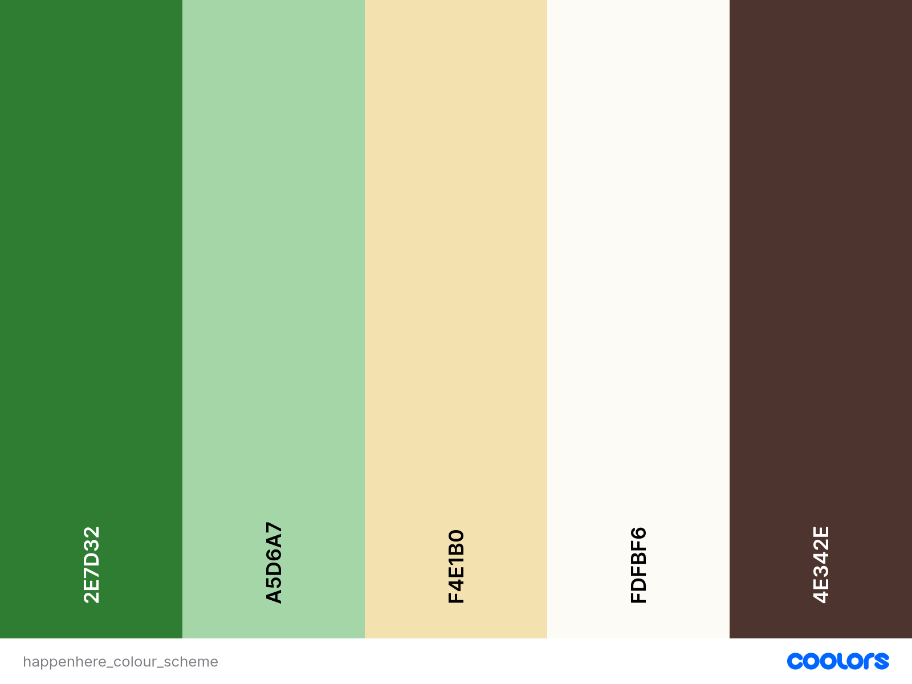

### Wireframes
| Page | Wireframe |
| --- | ----------- |
| Home | 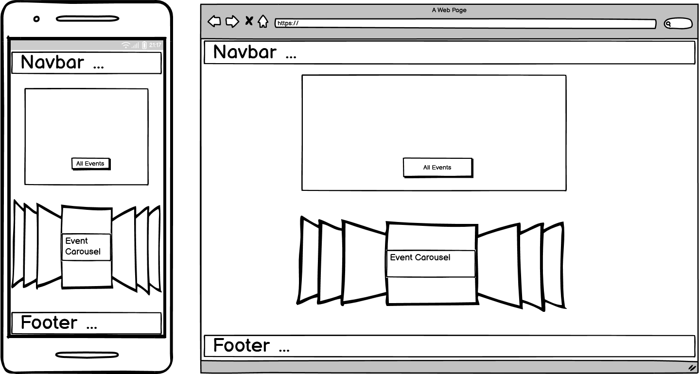 |
| All Events | 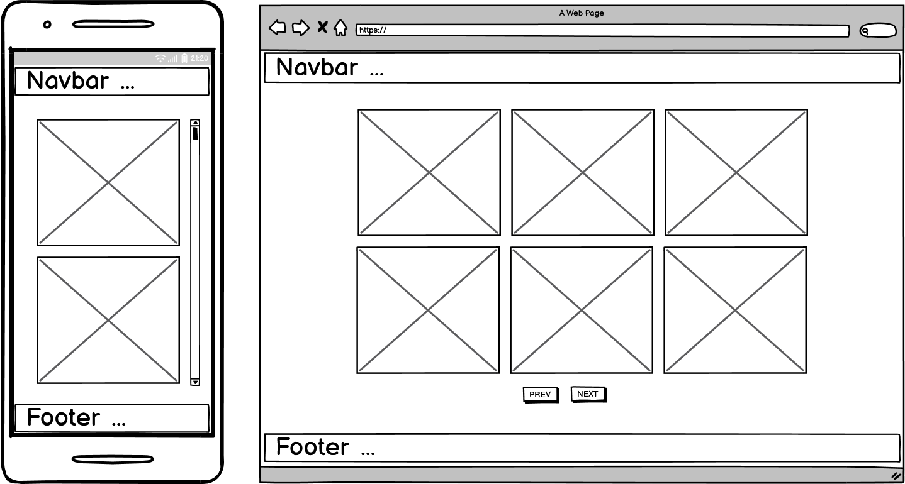 |
| Event Detail | 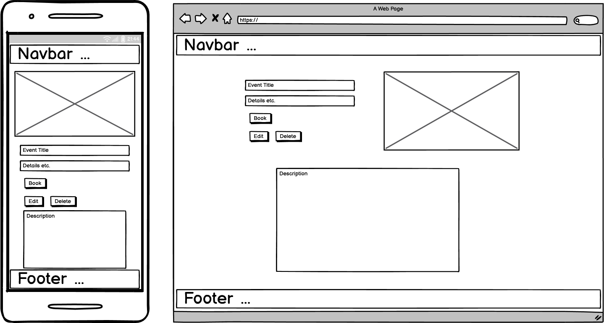 |
| Event Detail - Edit | 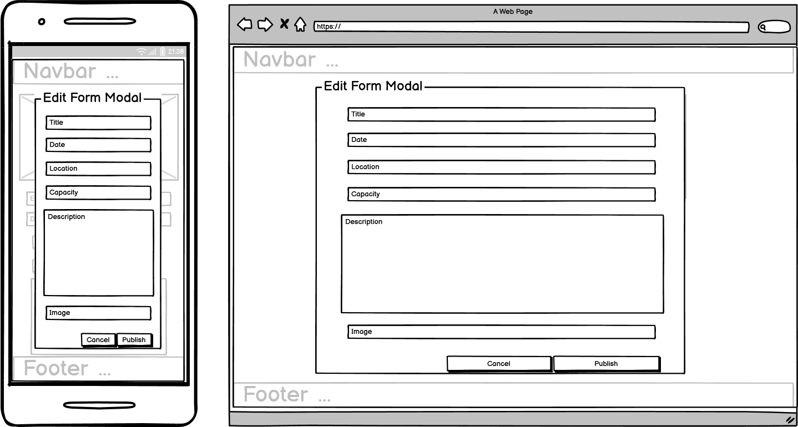 |
| Event Detail - Cancel booking / Delete event |  |
| My Events - Host | 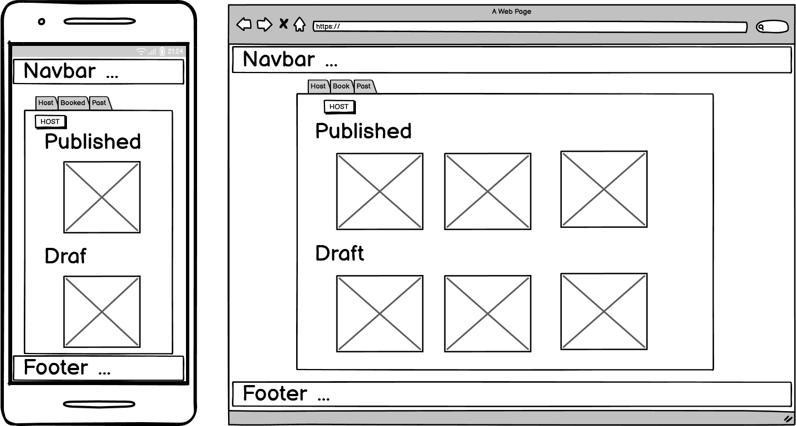 |
| My Events - Host Form |  |
| My Events - Booked / Published |  |

### Database

### Agile Methodology

- must-have
- should-have
- could-have

#### Project Board & User Stories
| Detail | Image |
| --- | ----------- |
| Issues in repo (leftover) | 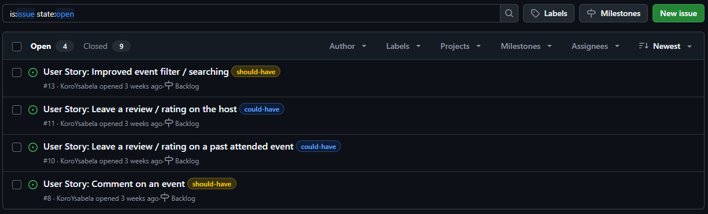 |
| Github Project Board & User Stories | 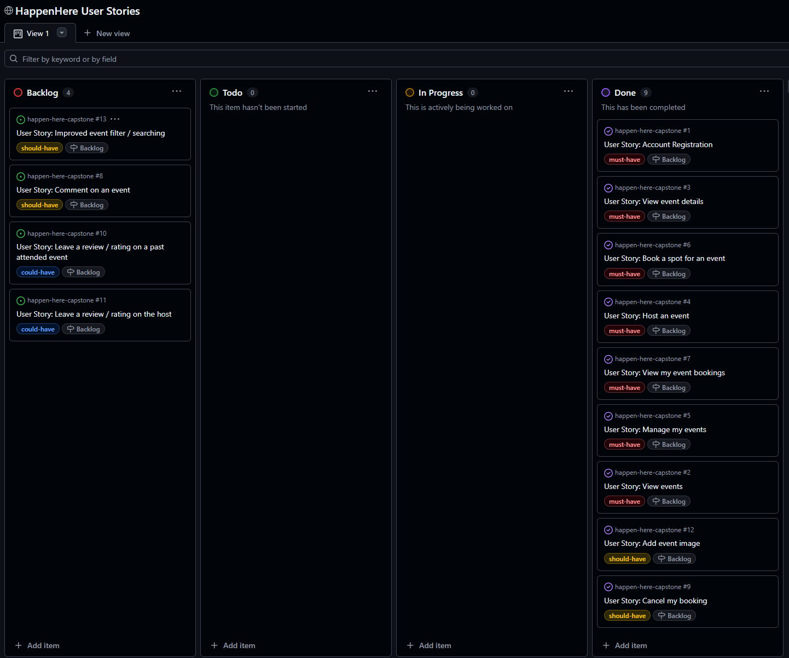 |

The project board for this project can be seen here:
<a href="https://github.com/users/KoroYsabela/projects/8" target="_blank">HappenHere - Project Board</a>

### Technologies Used

## Features
| Feature | Image |
| --- | ----------- |
| Homepage  | Image |
| All Events | Image |
| Event Detail - Book | Image |
| Event Detail - Cancel Booking | Image |
| Event Detail - Edit Event | Image |
| Event Detail - Delete Event | Image |
| My Events - Host Tab | Image |
| My Events - Host Event Form | Image |
| My Events - Booked Tab | Image |
| My Events - Past Tab | Image |

### User Authentication

### Custom Model & CRUD Functionality

## Testing and Validation
Everything in the table was tested, but due to high number of files only a few images were taken and included.
### HTML
| HTML | Pass/Fail |
| --- | ----------- |
| `events/templates/events/index.html`  |  |
| `events/templates/events/all_events.html` | PASS |
| `events/templates/events/event_detail.html` | WARNING & ERRORS (if using link to an event) - due to the use of django summernote widgets / PASS (when using `.html` file with warnings from the use of django code) |
| `myevents/templates/myevents/my_events.html` | PASS |
| `myevents/templates/myevents/login.html` | PASS |
| `myevents/templates/myevents/logout.html` | PASS |
| `myevents/templates/myevents/signup.html` | PASS |

### Python
| HTML | Pass/Fail |
| --- | ----------- |
| `config/settings.py`  | 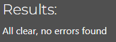 |
| `config/urls.py` | PASS |
| `events/admin.py` | PASS |
| `events/forms.py` | PASS |
| `events/models.py` | PASS |
| `events/urls.py` | PASS |
| `events/views.py` | PASS |
| `myevents/forms.py` | PASS |
| `myevents/models.py` | PASS |
| `myevents/urls.py` | PASS |
| `myevents/views.py` | PASS |

### JavaScript
| CSS | Pass/Fail |
| --- | ----------- |
| `static/js/evensHome.js` | 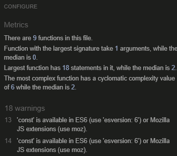 |

### CSS
| CSS | Pass/Fail |
| --- | ----------- |
| `static/css/style.css` | 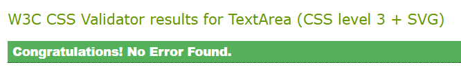 |

### Google's Lighthouse Performance
| Device | Performance | Accessibility | Best Practices | SEO |
| --- | ----------- | ----------- | ----------- | ----------- |
| Mobile | ... | ... | ... | ... |
| Desktop | ... | ... | ... | ... |

Performance is slightly lower due to having images for the event cards. Although a max size limit was added to do how much clouadinary could handle, in addition to the compressed default image, a lot of images on a page will naturally cause performance issues.

Best Practices were also lower due HTTPS from allowing the user to upload their own image.

### WAVE Accessibility
General testing on different pages using this tool showed no errors:

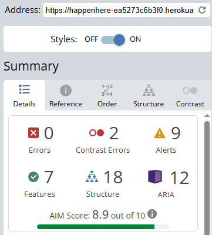

### Browser Compatability

## Bugs

## Future features and Development

## AI

## Deployment

View the deployed project on heroku: <a href="https://happenhere-ea5273c6b3f0.herokuapp.com/" target="_blank">HappenHere</a>

## Credits